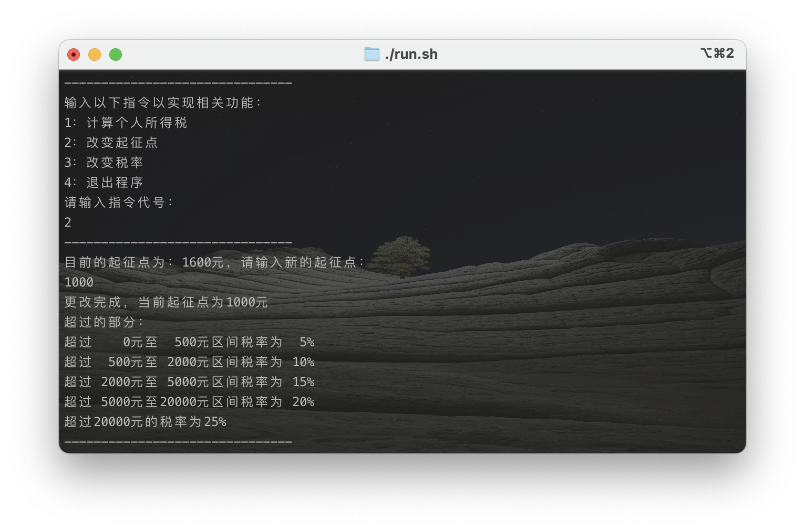
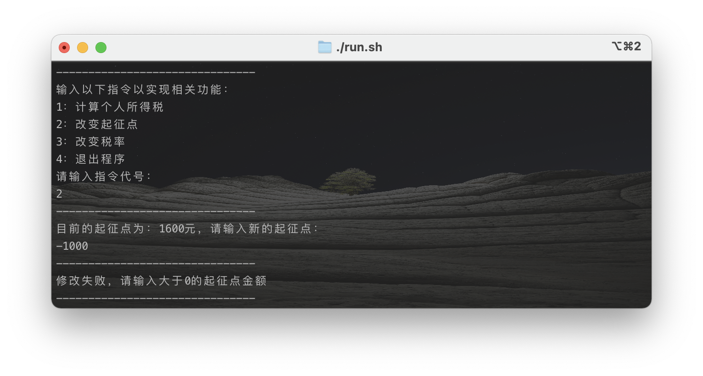
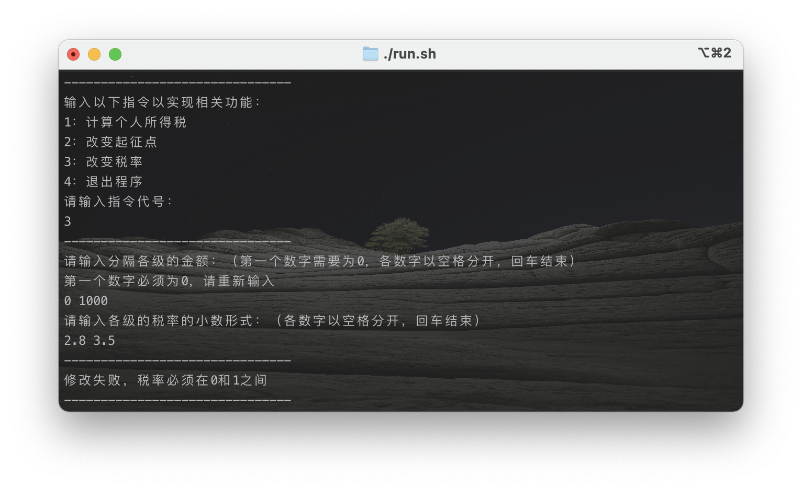

# 一个Java实现的用于计算个人所得税的程序

## 一、功能

- 基于命令行界面的计算个人所得税程序，根据用户输入的当月工资薪金总额计算应缴纳的个人所得税额

- 收入总额减去免征基数后剩余部分称为应纳税所得额，根据应纳税所得额按某种规定计算应缴纳的个人所得税

- 默认起征点为1600元

- 默认计税规则如下：

    | 级别 |          应纳税所得额           | 税率% |
    | :--: | :-----------------------------: | :---: |
    |  1   |          不超过500元的          |   5   |
    |  2   |  超过 500 元至 2,000 元的部分   |  10   |
    |  3   | 超过 2,000 元至 5,000 元的部分  |  15   |
    |  4   | 超过 5,000 元至 20,000 元的部分 |  20   |
    |  5   |       超过 20,000 元部分        |  25   |

- 该程序应支持对个人所得税起征点进行调整

- 个人所得税各级税率也允许修改

    > 例如，张三某月工资薪金总收入为 4,300 元，减去免征基数 1,600 元，则应纳税所得额为 2,700 元。
    >
    > 应纳税所得额中，超过 2,000 部分为 2,700 – 2,000 = 700 元，按 15%税率计算应纳税 105 元;而 500 元 至 2,000 元的部分为 1,500 元，按 10%税率计算应纳税 150 元;不超过 500 元的部分为 500 元，按 5% 税率计算应纳税 25 元。
    >
    > 所以，该月张三应缴纳的个人所得税金额为 105 + 150 + 25 = 280 元。

## 二、文件结构

- `src`文件夹中为代码源程序
- `run.sh`为编译运行的批处理文件，终端运行`./run.sh`即可运行程序
- `out`文件夹中为编译后的`.class`文件
- `JavaDoc`文件夹中为生成的`JavaDoc`文档，用浏览器打开其中的`index.html`即可

## 三、设计思路

### 1. UML类图


### 2. 结构描述

我设计了三个类，其中：

- 类`Presentation`用于显示界面以及和用户交互IO
- 类`TaxTable`根据计税规则维护一个表，包括创建和修改，并包括规则某些金额的获取函数供其他类调用
- 类`TaxCalculator`用于计算所得税的具体金额

> **上面只为简述，各个类的详细信息、各变量含义、各函数含义与参数意义详见代码注释或`JavaDoc`文档**

## 四、编译与运行

### 1. JDK版本：Java8


### 2. 编译与运行

在主目录下（即src文件夹的父目录）运行：

```sh
javac -sourcepath src -d out src/*.java
cd out
java personaltax.Presentation
```

此外，我已将这三条命令写到了批处理文件`run.sh`中，也可以直接运行：

```bash
./run.sh
```

## 五、运行截图

1. 运行后的开始界面，会显示当前各种信息：

    

2. 指令“1”，计算所得税金额

    

    这个测例即为要求文档中的例子，工资4300元所得税280元。

3. 指令“2”，改变起征点金额

    

4. 指令“3”，改变税率及计税规则

    
   
5. 指令“4”，退出程序

    

## 六、错误数据处理

除了基础功能外，如果输入了一些“不合法”的数据，程序也会提示并要求重新输入：

- 输入的指令并非1、2、3或4:

    
  
- 输入的起征点金额不大于0:

    

- 输入的税率不在0-1之间：

    